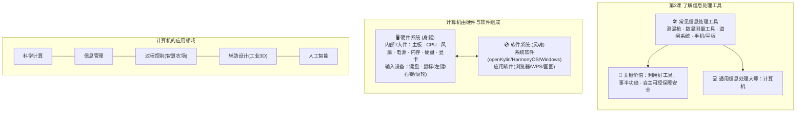

# 第3课 了解信息处理工具

| **学科** | 信息科技 |
|:---------|:----------------------------------------------------------------------------------------------------|
| **课题** | 第3课 了解信息处理工具 |
| **单元** | 第一单元 感受信息社会 |
| **年级** | 三年级上册 |
| **教材分析** | 本课是浙江教育版小学信息科技三年级上册第一单元第3课。在第1课感知智能生活现象的基础上，本课聚焦“信息处理工具”，引导学生由现象深入工具本质。教材围绕“认识常见的信息处理工具”“认识计算机”和“计算机的应用”三个层次步步推进。教材紧密响应课标模块三“在线学习与生活”内容要求，从生活真实情境出发，引导学生认识智能手机、平板电脑、测温枪、数字测量工具（数显卡尺）、道闸系统等典型工具；通过生动的机箱内部剖析图解构计算机硬件（主板、CPU、风扇、电源、硬盘、内存、显卡）与软件系统；教材特别注重科技自立自强素养培育，呈现了国产自主可控操作系统（开放麒麟 openKylin、华为鸿蒙 HarmonyOS），强调自主可控对信息安全的保障；最后展示了计算机在科学计算、信息管理、过程控制（智慧农场）、辅助设计（工业3D建模）、人工智能等领域的深远影响，为后续课时探究输入输出感知设备打下扎实的系统工具基础。 |
| **学情分析** | 三年级学生在日常生活中经常接触智能手机、平板电脑、数码相机等设备，对数字化工具有着浓厚的兴趣与好奇心。但三年级学生的认知普遍停留在“工具很好玩、能打游戏看视频”的表面娱乐感知，缺乏对“信息处理”（输入、加工、存储、输出）逻辑的理性认识，容易将通电工作的机械设备与信息处理工具混淆。 此外，三年级学生刚刚步入机房，对计算机的软硬件组成缺乏清晰认知，对主板、CPU、内存等内部构件感到神秘而陌生，对键盘与鼠标的规范操作（如鼠标滚轮滑动、左键双击、指法按键）尚需规范指导；对国产自主可控系统与信息安全缺乏前置概念。因此，本课需依托实物图示、拆机透视、情境体验与上机实操，引导学生建构软硬件协同观念，树立崇尚科学、支持国产自立自强的积极价值观。 |
| **核心素养** | 1. **信息意识**：能识别智能手机、测温枪、数字测量工具、道闸系统等常见信息处理工具；知道信息需要工具进行采集与处理，感受信息处理工具给日常学习和生活带来的高效率与便捷性。 2. **计算思维**：通过剖析计算机内部构造与工作过程，初步理解“硬件协同运作、软件驱动硬件”的系统逻辑；能将复杂现实问题分解为“待处理信息”与“工具匹配”的对应关系。 3. **数字化学习与创新**：通过观察与上机操作，认识键盘与鼠标（左键、右键、滚轮）的结构与功能，掌握规范握持与操作方法；能利用计算机进行基础文字输入与信息检索，体会数字化工具处理信息的强大功能。 4. **信息社会责任**：通过了解我国自主可控操作系统（openKylin、HarmonyOS），体会自主研发对国家信息安全的重要战略意义；遵守机房规章制度，爱护计算机设备，树立健康用眼与安全使用信息工具的意识。 |
| **重点** | 1. 认识日常学习与生活中常见的信息处理工具及其主要功能，理解其对提高效率的作用。 2. 认识通用信息处理工具——计算机的组成（软硬件系统、计算机内部7大构件及常见输入输出设备），了解计算机的五大典型应用领域。 |
| **难点** | 1. 理解计算机“硬件”与“软件”的协同关系，理解自主可控技术对信息安全的保障意义。 2. 规范掌握鼠标（左右键、滚轮）与键盘的操作，能够在真实生活场景中分析信息处理需求并选择适宜工具。 |

 

| 教学环节 | 教师活动 | 学生活动 | 设计意图 |
|:---------|:----------------------------------------|:------------------------------------|:-------------------|
| **导入新课** | 1. **情境激趣（身边的得力助手）**： - 出示课本第9页主题图：智能手机、平板电脑、数码相机、录音设备。 - 提问：“每天早晨走进校园、走入教室，有哪些工具在悄悄帮助我们处理各种信息？” 2. **观察图示与思考**： - 展示两张醒目的操作系统桌面图：**openKylin（开放麒麟）计算机操作系统** 与 **HarmonyOS（鸿蒙）手机操作系统**。 - 启发：“除了我们看得见的手机屏幕和电脑外壳，屏幕里面运行的‘大脑管家’是什么？”引出操作系统的概念。 3. **揭示课题**： - 顺势导入：“工欲善其事，必先利其器。今天我们就一起来探秘人类智慧的结晶——第3课《了解信息处理工具》！” | 1. 观察大屏幕，结合上学与居家日常，踊跃发言列举（智能手机测温、平板打卡、相机拍照留念等）。 2. 观察国产麒麟与鸿蒙系统界面，在教师引导下认识到设备内部还有“操作系统”在调度管理一切。 3. 明确本课学习目标：认识常见信息处理工具、解密计算机组成、学会用计算机解决问题。 | 通过课本原版图示唤醒真实生活经验，巧妙引入国产操作系统 openKylin 与 HarmonyOS，激发学生的爱国热情与探索求知欲，自然切入本课主题。 |
| **讲授新课** | 1. **第一站：认识常见的信息处理工具（课本P10）**： - 出示课本四大典型工具图示：   · **测温枪**：快速非接触红外测温，守护健康第一线；   · **数字测量工具（数显卡尺）**：数字液晶屏直显微米级尺寸，精准高效不用眯眼看刻度；   · **道闸系统**：人脸识别与刷卡感应，秒级通行记录人员出入；   · **计算机**：多功能全能信息处理大师。 - 提问：“利用好这些信息处理工具，为什么能够事半功倍？”引导学生对比传统人工方式的慢与累。 - **渗透小知识**：介绍“自主可控技术”——就像自己家的大门钥匙必须握在自己手中一样，采用我国自主可控的软硬件芯片与系统，能从根本上为国家和个人筑牢安全屏障。  2. **第二站：解密全能大师——认识计算机（课本P11）**： - 讲解概念：通常将组成计算机的各种物理设备统称为**硬件**，各种程序和数据统称为**软件**。“硬件是骨骼身躯，软件是思想灵魂，只有安装了各种各样的软件，计算机才具备强大的功能。” - **机箱内部大解密（7大核心构件）**：   出示课本计算机内部结构透视图，逐一形象化拆解讲解：   ① **主板**：四通八达的高速公路，连接所有部件；   ② **CPU（中央处理器）**：核心大脑，负责超高速运算与发号施令；   ③ **风扇**：强力散热空调，保障电脑冷静运行；   ④ **电源**：能量心脏，将电能平稳输送给各个部件；   ⑤ **内存**：临时高速工作台，存放正在运行的数据；   ⑥ **硬盘**：超大记忆仓库，永久存储照片、文件与软件；   ⑦ **显卡**：超级画师，负责把数据转换成精美画面呈现在显示器上。  3. **第三站：计算机的五大应用领域（课本P11）**： - 结合课本插图展开全景视野：   · **信息管理**：图书借阅自动检索、大数据办公同步；   · **过程控制（智慧农场）**：传感器监控土壤湿度，自动控制喷灌与无人机施肥；   · **工业设计**：工程师在电脑里使用3D软件精密建模飞机发动机；   · **科学计算 & 人工智能**：超级计算机模拟台风路径，AI机器人智能对话辅助学习。 | 1. 仔细观察测温枪、数显卡尺、道闸和计算机，各抒己见讨论各工具的独特本领与应用场景。 2. 聆听“自主可控”小知识，明白核心技术必须自主研发，才能真正保障数据安全的深刻道理。 3. 专注观察计算机内部解剖图，在教师比喻中轻松理解主板、CPU、风扇、电源、内存、硬盘、显卡各自的分工职责，消除对主机箱的神秘感。 4. 观看智慧农场自动化灌溉与工业3D设计的实景视频片段，惊叹于计算机深入现代社会的方方面面。 | 紧扣课本原图展开系统建构，从专用工具（测温/数显测量/道闸）过渡到通用计算机；采用拟人化比喻解构内部7大硬件，有效化解教学难点；融入国家自主可控育人目标。 |
| **课堂练习** | 1. **实操一：规范结识输入设备——鼠标与键盘（课本P12）**： - 指导学生就座观察电脑桌上的鼠标与键盘实物：   · **鼠标解密**：学习课本标准手势（手掌自然覆于鼠标上方，食指放在**左键**，中指放在**右键**，食指轻轻拨动中间的**滚轮**）。示范左键单击（选中）、双击（打开程序）、右键单击（弹出菜单）、滚轮滑动（页面上下翻阅）。   · **键盘解密**：认识主键盘区字母键、空格键与回车键。 - 学生在写字板或文本编辑软件中完成实机操作：敲入名字拼音与座号。  2. **实操二：生活应用大搜索与填空表达（课本P12“试一试”）**： - 引导学生在浏览器中打开搜索页面，以“计算机的应用”为关键词浏览发现。 - 完成导学单上的经典句式仿写与交流：   · 在 **商店** ，我看见 **收银员用计算机结账收银** 。   · 在 **医院** ，我看见 **医生用计算机调阅CT检查影像并开具处方** 。   · 在 **图书馆** ，我看见 **借阅机自动扫描图书条码办理借还手续** 。   · 我知道计算机还能 **指挥航天飞船发射、辅助气象局预测未来天气** 。 - 巡视指导学生规范按键、文明检索，抽查学生代表分享。 | 1. 端正坐姿，双手摆放规范。模仿教师动作正确握持鼠标，练习食指单击左键打开程序、中指轻触右键、食指拨动滚轮翻页。 2. 在键盘上认真找到字母键，成功在屏幕上敲出自己的名字拼音，体验人机互动的喜悦。 3. 打开浏览器开展检索，联系生活经验完成《试一试》句式填空，向同桌分享自己的发现。 4. 小组内交流日常生活中见过的各类信息处理工具，巩固所学。 | 落实课本P12实操技能要求，将鼠标与键盘的物理规范训练与思维表达紧密结合，既夯实上机动手基本功，又提升语言表达与知识迁移能力。 |
| **课堂小结** | 1. **梳理脉络，回顾所得**： - 教师对照板书引导全班共同复述：常见工具 ➔ 计算机内部7大构件 ➔ 鼠标键盘输入设备 ➔ 丰富应用领域。 2. **信息安全与习惯养成**： - 总结提升：信息处理工具让生活更美好，但我们要牢记：使用工具要**有度、安全、守信**。 - 指导学生规范执行关机流程（【开始】➔【关机】），将键盘推入凹槽，鼠标摆正，椅子推入课桌。 3. **布置课后趣味探究（课本P12“练习”）**： - “回家后，在家长的指导下，上网查找、学习电子计算机的发展历程（从庞大的ENIAC到现代超级计算机），并在导学案上记录下自己的心得体会。” | 1. 师生共同回顾本课关键知识点，完善导学单自评量规。 2. 牢记安全规范，按照标准程序关闭电脑系统，整理机房工位。 3. 记清课后拓展任务，期待与家长一同探索计算机的传奇进化史。 | 形成教学闭环，强化机房良好行为习惯；对接课本课后练习要求，实现课堂教学向家庭亲子探究的延伸。 |

 

### 附：结构化板书设计

> 💡 **板书设计意图说明**：
> 1. **忠实教材、脉络分明**：紧密对齐课本第9至12页四大板块（常见工具、计算机组成、硬件解密、应用领域），层次井然。
> 2. **突出信创与核心硬件**：在硬件区清晰列出课本重点展示的机箱内部7大核心构件及鼠标键盘结构，在软件区突出国产 openKylin 与 HarmonyOS，强化安全自主意识。
> 3. **图文结构化易记**：采用流程拓扑架构，将零散知识点整合为系统性思维图景，便于三年级学生快速理解与复习建构。
